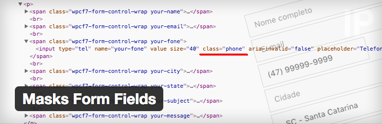

Masks Form Fields
=========================

        [](https://wordpress.org/plugins/masks-form-fields/)

A plugin to add masks in the form’s fields for WordPress.

[](https://wordpress.org/plugins/masks-form-fields/)

Download the plugin via WordPress.org => https://wordpress.org/plugins/masks-form-fields/

## Basic Usage Examples

Add a class in the form field.

Example of use with [Contact Form 7](https://wordpress.org/plugins/contact-form-7/): 

`[tel your-phone class:phone placeholder "Phone"]`

Listing of classes available for use.

```
('span.start, input.start').mff_mask('00/0000');
('span.date, input.date').mff_mask('00/00/0000');
('span.time, input.time').mff_mask('00:00:00');
('span.time2, input.time2').mff_mask('00:00');
('input.date_time').mff_mask('00/00/0000 00:00:00');
('input.date_time2').mff_mask('00/00/0000 00:00');
('input.cep').mff_mask('00000-000', { clearIfNotMatch: true });
('input.zip').mff_mask('00000');
('input.phone, input[name="phonebr"]').mff_mask(PhoneMaskBehavior, nonoOptions);
('input.phone_us').mff_mask('(000) 000-0000');
('input.taxid').mff_mask('00-0000000');
('input.ssn').mff_mask('000-00-0000');
('input.mixed').mff_mask('AAA 000-S0S');
('input.cpf').mff_mask('000.000.000-00', { reverse: true, clearIfNotMatch: true });
('input.cnpj').mff_mask('00.000.000/0000-00', { reverse: true, clearIfNotMatch: true });
('input.money').mff_mask('000.000.000.000.000,00', { reverse: true });
('input.money2').mff_mask('#.##0,00', { reverse: true });
('input.money3').mff_mask('#,##0.00', { reverse: true });
('input.money4').mff_mask('000,000,000,000,000.00', { reverse: true });
('input.money5').mff_mask('#.##0', { reverse: true });
('input.money6').mff_mask('#,##0', { reverse: true });
('input.ip_address').mff_mask('099.099.099.099');
('input.percent').mff_mask('##0,00%', { reverse: true });
('input.percent2').mff_mask('##0.00%', { reverse: true });
('input.percent3').mff_mask('990,0%', { reverse: true });
('input.percent4').mff_mask('990.0%', { reverse: true });
('input.percent5').mff_mask('#,##0%', { reverse: true });
('input.percent6').mff_mask('#.##0%', { reverse: true });
```

[*Click here*](https://gist.github.com/petermann/fd1a898e02ca91a0d7231a9f8ee662b4) for more details on how to add custom mask.

**Optional**
- Added option for the format of the Brazilian phone number, with attribute `name` equal to `phonebr`.

## Installation

Installing "Masks Form Fields" can be done either by searching for "Masks Form Fields" via the "Plugins > Add New" screen in your WordPress dashboard, or by using the following steps:

1. Download the plugin via WordPress.org => https://wordpress.org/plugins/masks-form-fields/
2. Upload the ZIP file through the 'Plugins > Add New > Upload' screen in your WordPress dashboard
3. Activate the plugin through the 'Plugins' menu in WordPress

### Credits

* [jQuery Mask Plugin](https://github.com/igorescobar/jQuery-Mask-Plugin)
